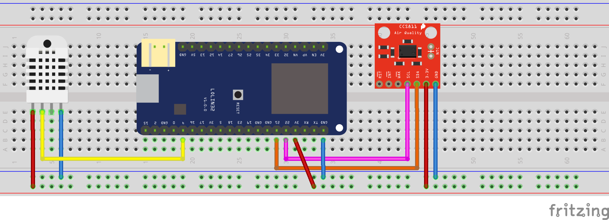

# Raumklima

Genauere Infos [in diesem Blogpost](https://gnulinux.ch/raumklima-messen-und-aufzeichen-mit-esp32-und-influxdb).

## Hardware
- ESP32 WEMOS LOLIN32
- Temperatur und Luftfeuchtigkeitsensor DHT22
- Luftqualitätssensor CSS811

### Verdrahtung

## Datenbank und Dashboard
Als Datenbank wird InfluxDB 2.0 vewendet. Das Dashboard ist bei InfluxDB 2.0 bereits integriert.

## ESP32 Software
Als Entwicklungsumgebung wurde VS Code mit PlatformIO verwendet.
