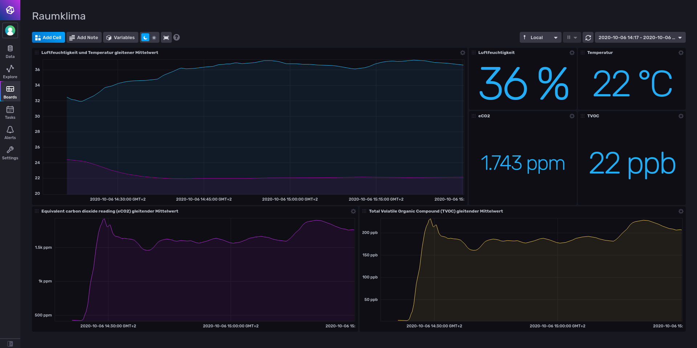
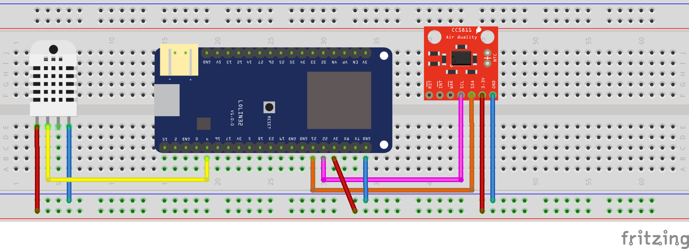
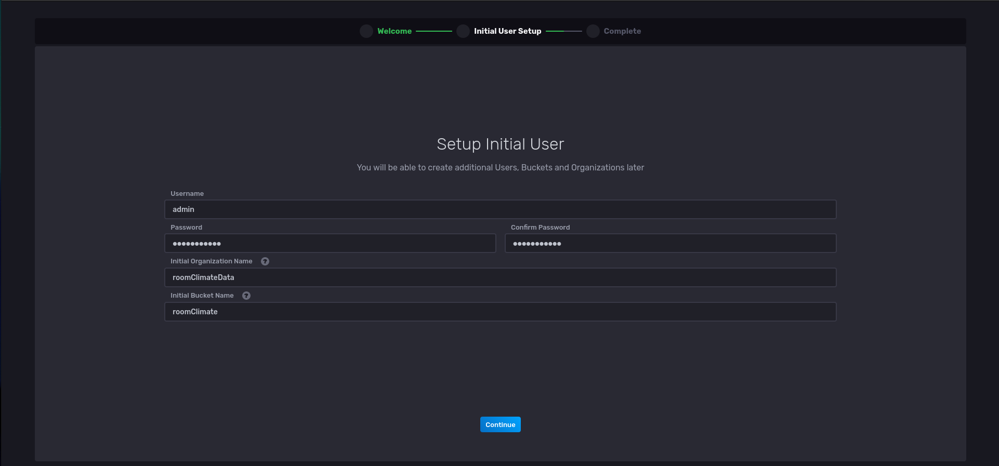
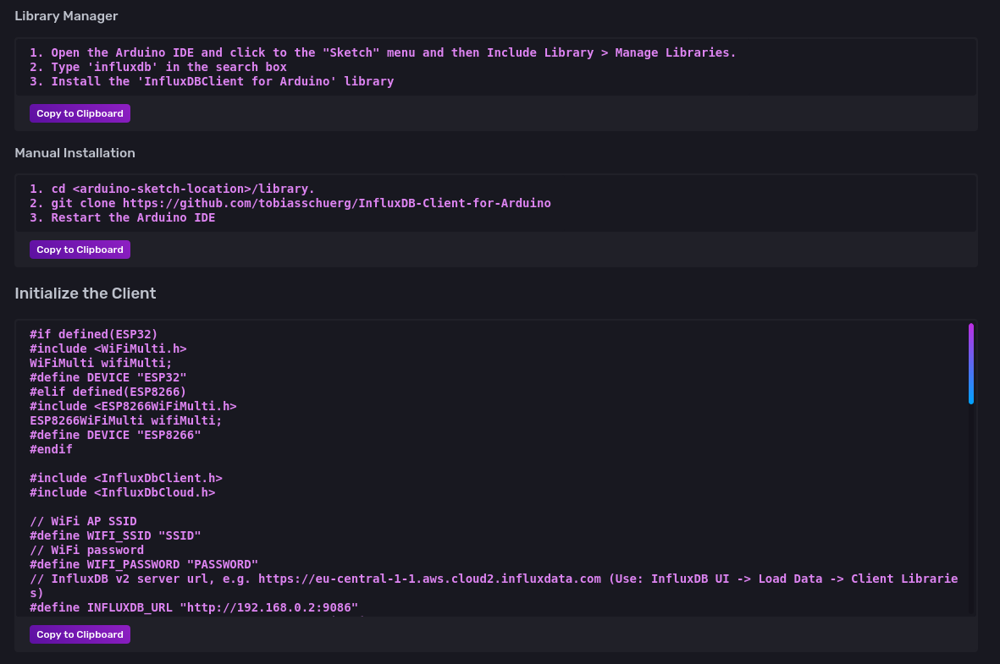

# Raumklima messen und aufzeichen mit ESP32 und InfluxDB



## Motivation
Der Winter nähert sich in grossen Schritten. Es wird kühler draussen und die Heizung nimmt wieder ihren Dienst auf. Seit nun fast sechs Monaten teilen wir unser Schlafzimmer mit unserem Sohn. Im Frühling und Sommer war das Raumklima nie ein Thema, da es immer warm war und man mit offenem Fenster schlafen konnte.

Wenn aber drei Personen in einem kleinen Schlafzimmer schlafen und die Heizung auch noch läuft, ist das morgentliche Erwachen meist mit Husten und trockenem Mund verbunden, vor allem bei unserem kleinen Jungen.

Als methodisch denkender Mensch, wollte ich zuerst einige Daten erheben, bevor ich am System willkürlich Änderungen vornehme.
## Hardware
Als Basis für mein Vorhaben dient ein ESP32 (LOLIN32 V1.0.0 ESP32 Board 4 MB FLASH). Dieser hat schon Wi-Fi an Board, kann I²C und hat einige GPIO. Ich möchte gerne die Temperatur, Luftfeuchtigkeit und die allgemeine Luftqualität messen. Dazu habe ich folgende Sensoren verwendet:

- Temperatur und Luftfeuchtigkeit [DHT22](https://learn.adafruit.com/dht)
- Luftqualität [CCS811](https://learn.sparkfun.com/tutorials/ccs811-air-quality-breakout-hookup-guide) ([eCO2](https://en.wikipedia.org/wiki/Carbon_dioxide_sensor#Estimated_CO2_sensor) und [TVOC](https://en.wikipedia.org/wiki/Volatile_organic_compound))

Da es sich um eine temporäre Installation handelt, ist alles auf einem Breadboard aufgebaut.



## Software
### Entwicklungsumgebung
Die ESP's können mit der Arduino IDE programmiert werden. Allerdings ist die Arduino IED für einen Softwareentwickler keine ernsthafte Option. Es fehlt an den grundlegensten Dingen. Darum verwende ich für solche Projekte immer VS Code mit der [PlatformIO](https://platformio.org/) Erweiterung.

### Datenbank und Dashboard
Ein kurzer Disclaimer vorweg: [InfuxDB 2.0 OSS](https://docs.influxdata.com/influxdb/v2.0/) ist noch nicht stable, aber ist als RC erhältlich. Die Enterprise Lösung von InfluxDB 2.0 ist allerdings schon länger erhältlich.

Mit InfluxDB 2.0 kommt die Datenbank und das Dashboard in einem Paket zusammen. Vor der Version 2.0 musste für das Dashboard immer noch Grafana oder Chronograf installiert werden. Bei der Datenbank handelt es sich um eine [Zeitreihendatenbank](https://de.wikipedia.org/wiki/Zeitreihenanalyse), sie ist also keine relationale Datenbank. Für meinen Zweck ist das also perfekt.

Die InfluxDB läuft am schnellsten mit einem `docker-compose up -d`.

```yml
version: '2'
services:
  influxdb:
    image: quay.io/influxdb/influxdb:2.0.0-rc
    container_name: RoomClimateInfluxDB2
    restart: always
    ports:
      - '9086:8086'
    volumes:
      - ./data:/root/.influxdbv2
    command:
      --reporting-disabled
```
Mit dem Flag `--reporting-disabled` wird die Telemetrie deaktiviert.

Wenn der Container läuft, kann im Onboarding auf dem Webinterface (`http://ipAdresse:9086`) die Datenbank konfiguriert werden.



Sobald alles eingerichtet ist, findet sich unter `Data` eine Anleitung und der **fertige** Arduino Code inklusive Token, IP der Datenbank etc. Es müssen nur noch die Sensoren eingelesen werden und die Werte in die Datenbank geschrieben werden.



Das komplette Projekt ist auf Github [https://github.com/MrReSc/RoomClimate/tree/main](https://github.com/MrReSc/RoomClimate/tree/main) verfügbar.

